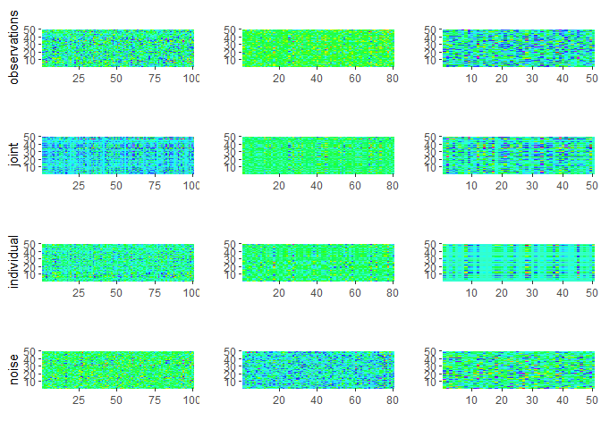

<!-- README.md is generated from README.Rmd. Please edit that file -->

# RaJIVE

<!-- badges: start -->

<!-- badges: end -->

RaJIVE (Robust Angle based Joint and Individual Variation Explained) is
a robust alternative to the aJIVE method for the estimation of joint and
individual components in the presence of outliers in multi-source data.
It decomposes the multi-source data into joint, individual and residual
(noise) contributions. The decomposition is robust with respect to
outliers and other types of noises present in the data.

## Installation

You can install the released version of RaJIVE from
[CRAN](https://CRAN.R-project.org) with:

``` r
install.packages("RaJIVE")
```

And the development version from [GitHub](https://github.com/) with:

``` r
# install.packages("devtools")
devtools::install_github("ericaponzi/RaJIVE")
```

## Example

This is a basic example which shows how to use RaJIVE on simple
simulated data:

### Running robust aJIVE

``` r
library(RaJIVE)
## basic example code
n <- 50
pks <- c(100, 80, 50)
Y <- ajive.data.sim(K =3, rankJ = 3, rankA = c(7, 6, 4), n = n,
                   pks = pks, dist.type = 1)

initial_signal_ranks <-  c(7, 6, 4)
data.ajive <- list((Y$sim_data[[1]]), (Y$sim_data[[2]]), (Y$sim_data[[3]]))
ajive.results.robust <- Rajive(data.ajive, initial_signal_ranks)
```

The function returns a list containing the aJIVE decomposition, with the
joint component (shared across data sources), individual component (data
source specific) and residual component for each data source.

### Visualizing results:

  - Joint rank:

<!-- end list -->

``` r

get_joint_rank(ajive.results.robust)
#> [1] 3
```

  - Individual ranks:

<!-- end list -->

``` r
get_individual_rank(ajive.results.robust, 1)
#> [1] 5
get_individual_rank(ajive.results.robust, 2)
#> [1] 3
get_individual_rank(ajive.results.robust, 3)
#> [1] 1
```

  - Heatmap decomposition:

<!-- end list -->

``` r
decomposition_heatmaps_robustH(data.ajive, ajive.results.robust)
```



  - Proportion of variance explained:

<!-- end list -->

``` r
showVarExplained_robust(ajive.results.robust, data.ajive)
#> $Joint
#> [1] 0.3148569 0.3349692 0.4197429
#> 
#> $Indiv
#> [1] 0.5499653 0.4156423 0.1522468
#> 
#> $Resid
#> [1] 0.1351778 0.2493886 0.4280103
```
